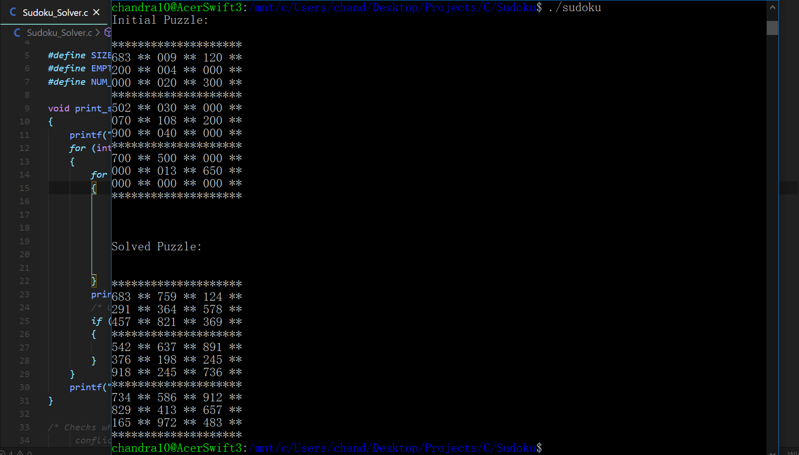
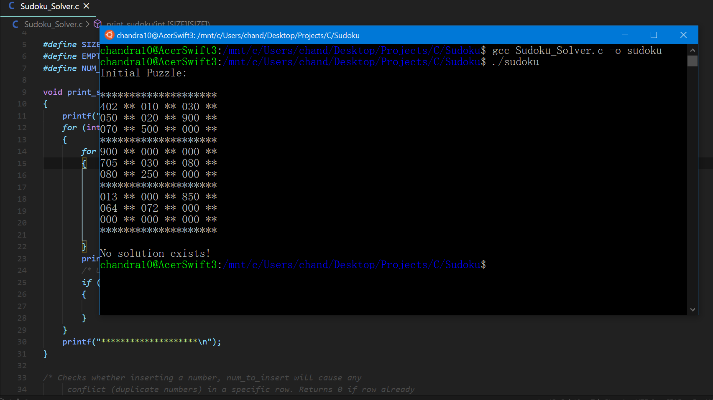

# Sudoku Solver
Randomly generates a sudoku puzzle and solves it using recursive backtracking.

## What program looks like

 

## Dependencies

**GCC** - to compile C file.

## Running the program

1. Fork the repo, download files manually or clone.
2. Using the terminal, cd into the local copy of the repo.
3. Enter "gcc Sudoku_Solver.c -o sudoku" into terminal.
4. Enter "./sodoku" into terminal.
